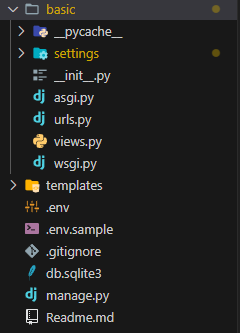
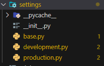
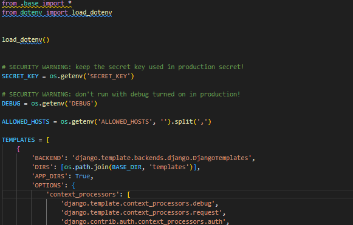
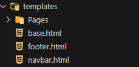
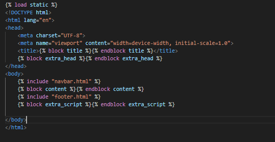
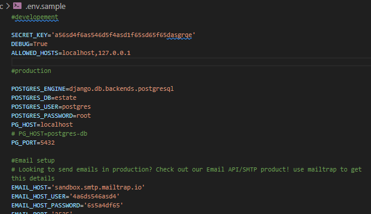

# Welcome to My Django Basic structure of settings and template full setup guide

This file already setup for Quick start you just have to copy this file

In this file you see

###  1. Fully setup settings configration

1. File structure
    


2. Setting File config



3. for now this project is working on development.py



### 2. Template settings

We are using proper template structure its easy to manage you template files




we already created base template to easy to access header and footer at every pages




### 3. How to setup .env file (WE already setup don't worry)

1. we provide you .env.sample just replace you value




# Quick Launch guide

## Copy this github repo

1. git clone link 
2. cd basic

## Now create Virtualenv for out project

1. I am using Python version 3.11.0

```bash
python --version
```

2. Install virtualenv 

```bash
 pip install virtualenv
```

3. make virtualenv 
```bash
virtualenv venv
```

4. Start virtualenv 

for windows
```bash 
venv/scripts/activate
```

for linux
```bash
source venv/bin/activate
```
## Now install Requirements for this project

we need only 2 things Django and python-dotenv
or you just install form my requirements.txt file

```bash 
pip install django python-dotenv
```
or

```bash
pip install -r requirements.txt
```

## Now make (.env) file 

1. Copy all the content form .env.sample

    it help you to quick start without any error 

    just you have to replace all the values

## Make database 

```bash
python manage.py migrate
```

# I hope you like this project without any errors
if it any error just let me know and any thing you want to suggest for setting for quick start project pls reply 

Eshaan Manchanda: https://www.linkedin.com/in/eshaan-manchanda/
